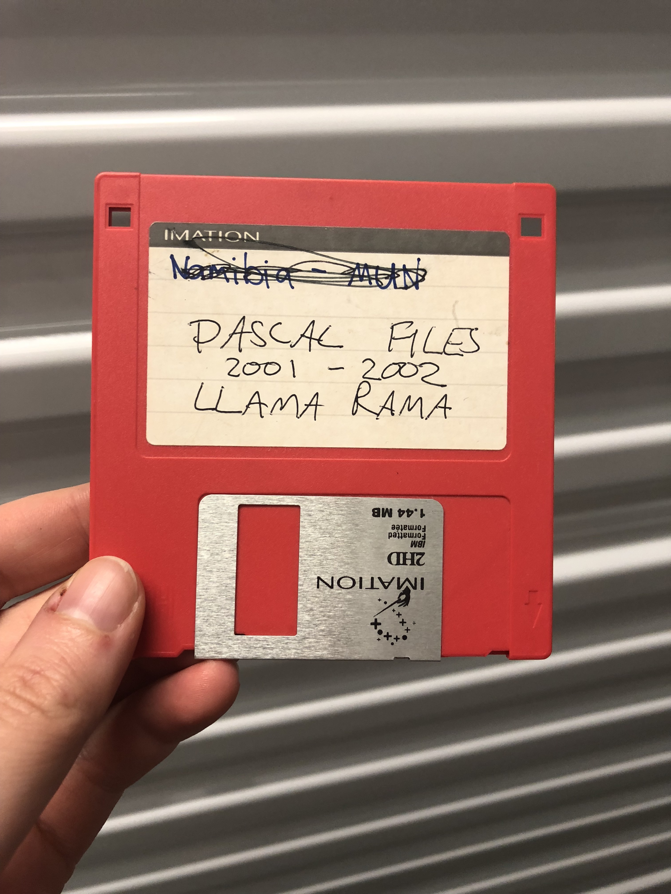

# llama-rama
My first computer science class project from 2002. Co-author was an eccentric freshman named Dennis. Credit to Dennis for Llama inspiration.

I'm not sure if I can get this running anymore, as it's hard to replicate the Pascal graphics modes. In high school we had some old IBM computers, and learning to program the sound was always a fun day of class. If you didn't add a command to turn the sound off at the program's end, the sound would continue even after program termination. After kicking off an endless EEEEEEEEEEEEE, students would scramble to write a new program to silence the noise. 

Pascal tends to be spaghetti code, and we never learned Object Oriented design, but this seems modular enough given my experience. I don't think I would be in tech today if it weren't for this class -- I really discovered my capability for writing code, and how creative it could be. My teacher was also a woman! She was great (though I sadly don't remember her name).

I was in Model United Nations representing Namibia for Intellectual Property rights. I got to wear a blazer and go to the University. 
